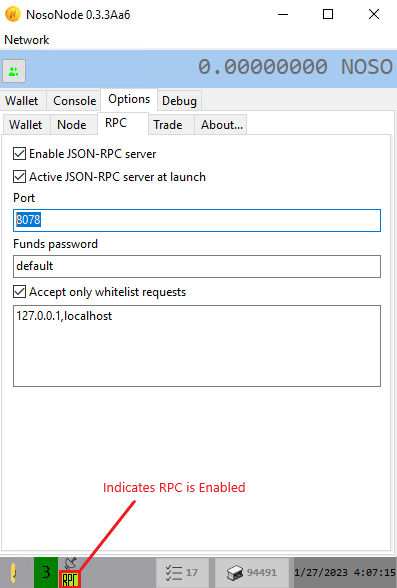

# Running a Noso JSON-RPC node for development Utilizing Noso's REST API

### The Noso RPC node enables the front-end application layer and the backend protocol layer to interact with one another through a request-reply function that transmits information between the client and server.

To set up a Noso RPC node, you must first download and install NosoNode software from the Noso Project Github repository [(here)](https://github.com/Noso-Project/NosoNode). Once NosoNode software is installed, navigate to the <mark style="color:red;">**“Options > RPC” tab**</mark>. From the <mark style="color:red;">**RPC tab, specify your RPC TCP port (Default 8078) and check the box “Enable JSON-RPC server”**</mark>. You will see the word RPC in yellow at the bottom indicating RPC is enabled. It is highly recommended to whitelist the IP addresses of specific servers allowed to connect especially when hosted publicly.

<figure><figcaption></figcaption></figure>

## The following JSON Remote Procedure Calls are accessible


You can access all these calls by using our RPC tester [(here)](https://github.com/Noso-Project/RPCTester)


## <mark style="color:yellow;">“getaddressbalance”</mark> returns: balance,incoming,outgoing of the specified addresses.


<mark style="color:green;">**Example JSON-RPC call:**</mark>&#x20;

{ "jsonrpc" : "2.0", "method" : "getaddressbalance", "params" : \["NpryectdevepmentfundsGE"], "id" : 7 }

<mark style="color:green;">**Example JSON-RPC Result:**</mark>

{ "jsonrpc" : "2.0", "result" : \[{ "valid" : true, "address" : "NpryectdevepmentfundsGE", "alias" : null, "balance" : 3350262539961, "incoming" : 0, "outgoing" : 0 }], "id" : 7 }


## <mark style="color:yellow;">“getorderinfo”</mark> returns: timestamp, block, receiver, amount, reference of the specified order.”


<mark style="color:green;">**Example JSON-RPC call:**</mark>

{ "jsonrpc" : "2.0", "method" : "getorderinfo", "params" : \["OR1bcn6hjpghwgluly8h3xy8o0mei2yi4d6hjnx60v629t92z1ts"], "id" : 8 }

<mark style="color:green;">**Example JSON-RPC Result:**</mark>

{ "jsonrpc" : "2.0", "result" : \[{ "valid" : true, "order" : { "orderid" : "OR1bcn6hjpghwgluly8h3xy8o0mei2yi4d6hjnx60v629t92z1ts", "timestamp" : 1674790860, "block" : 94490, "type" : "TRFR", "trfrs" : 1, "receiver" : "N2Xwndryx9BFtsDQGFYAZPwSuw7H9FM", "amount" : 17977231, "fee" : 1797, "reference" : "PoolPay\_GoneFishing", "sender" : "N3ESwXxCAR4jw3GVHgmKiX9zx1ojWEf" } }], "id" : 8 }


## <mark style="color:yellow;">“getblockinfo”</mark> returns: number, timestart, timeend, timetotal, last20, totaltransactions, difficulty,target, solution, lastblockhash, nextdifficulty, miner, feespayed, reward of the specified block.


<mark style="color:green;">**Example JSON-RPC call:**</mark>

{ "jsonrpc" : "2.0", "method" : "getblocksinfo", "params" : \["94490"], "id" : 9 }

<mark style="color:green;">**Example JSON-RPC Result:**</mark>

{ "jsonrpc" : "2.0", "result" : \[{ "valid" : true, "number" : 94490, "timestart" : 1674790801, "timeend" : 1674791400, "timetotal" : 599, "last20" : 0, "totaltransactions" : 29, "difficulty" : 0, "target" : "154F217AD7EF6D07E689C608802DB1F1", "solution" : "!!5!!!!!!!!!!!!!!!10146144900000010166482959134325258D04D0B245009535120500795820",&#x20;

"lastblockhash" : "154F217AD7EF6D07E689C608802DB1F1", "nextdifficult" : 193, "miner" : "N2MVecGnXGHpN8z4RqwJFXSQP6doVDv", "feespaid" : 194370, "reward" : 5000000000, "hash" : "5E71D00A2945E0884893ACD9A0C6AD72" }], "id" : 9 }


## <mark style="color:yellow;">“getmininginfo”</mark> returns: block, target, difficulty of the block being mined.


<mark style="color:green;">**Example JSON-RPC call:**</mark>

{ "jsonrpc" : "2.0", "method" : "getmininginfo", "params" : \[], "id" : 13 }

<mark style="color:green;">**Example JSON-RPC Result:**</mark>

{ "jsonrpc" : "2.0", "result" : \[{ "block" : 94491, "target" : "5E71D00A2945E0884893ACD9A0C6AD72", "miner" : "N3ESwXxCAR4jw3GVHgmKiX9zx1ojWEf", "diff" : "000000111017181646078C5529B97B22", "hash" : "!#)!!!!!!!!!!!!!!!102806738" }], "id" : 13 }


## <mark style="color:yellow;">“getpendingorders”</mark> returns: a list of pending orders.


<mark style="color:green;">**Example JSON-RPC call:**</mark>

{ "jsonrpc" : "2.0", "method" : "getpendingorders", "params" : \[], "id" : 14 }

<mark style="color:green;">**Example JSON-RPC Result:**</mark>

{ "jsonrpc" : "2.0", "result" : \[{ "pendings" : \["TRFR,N2MVecGnXGHpN8z4RqwJFXSQP6doVDv,N4KmPqzkYdeZYneAxtjLQCoZyUhDpHT,111807580,11181", "TRFR,N3pzgU2jpvhjW6cSJL8zW8Rzj5fJdFa,Nfk2RJQG7xTUdR8TckhgtrqRLPyGEx,31472638,3147", "TRFR,N3ESwXxCAR4jw3GVHgmKiX9zx1ojWEf,N2BhUYhiepHVke8V7NVrUdit42xnAEt,76848009,7685", "TRFR,N3aXz2RGwj8LAZgtgyyXNRkfQ1EMnFC,N2kWBgQHrtiQPASTK67WmvtoL8e5GDn,55644228,5564", "TRFR,N2MVecGnXGHpN8z4RqwJFXSQP6doVDv,N2kWBgQHrtiQPASTK67WmvtoL8e5GDn,112276488,11228", "TRFR,N2MVecGnXGHpN8z4RqwJFXSQP6doVDv,N48ZtdfyydBDRVopeSxveQ2qCpWa9GL,9800480,980", "TRFR,N3ESwXxCAR4jw3GVHgmKiX9zx1ojWEf,NEsMdywQNHXWpMnoxNhtsGREyW9GGE,77904269,7791", "TRFR,N3pzgU2jpvhjW6cSJL8zW8Rzj5fJdFa,N7U1brSR8RBqrZZGMRhZQ8KP8MPNC1,103411950,10342", "TRFR,N3aXz2RGwj8LAZgtgyyXNRkfQ1EMnFC,Ntgp6CmSLVUzLrxVD2z21Ve7r2M5DR,46803208,4680", "TRFR,N2ophUoAzJw9LtgXbYMiB4u5jWWGJF7,N3TSJcSz9wetKamQUcjHUGsCtnkuCGB,99340774,9935", "TRFR,N2MVecGnXGHpN8z4RqwJFXSQP6doVDv,N3ZMRpo2c6xaJyTUNTeqbFbVZtui3Fb,103614686,10362", "TRFR,N3ESwXxCAR4jw3GVHgmKiX9zx1ojWEf,N2kWBgQHrtiQPASTK67WmvtoL8e5GDn,77904269,7791"] }], "id" : 14 }


## <mark style="color:yellow;">“getmainnetinfo”</mark> returns: lastblock, lastblockhash, headershash, summaryhash, pending, supply.


<mark style="color:green;">**Example JSON-RPC call:**</mark>

{ "jsonrpc" : "2.0", "method" : "getmainnetinfo", "params" : \[], "id" : 15 }

<mark style="color:green;">**Example JSON-RPC Result:**</mark>

{ "jsonrpc" : "2.0", "result" : \[{ "lastblock" : 94490, "lastblockhash" : "5E71D00A2945E0884893ACD9A0C6AD72", "headershash" : "E41D37527B0A9F0A01C63F32C52562E9", "sumaryhash" : "C21483546A23510F65E36FE0781B6FF7", "pending" : 12, "supply" : 473480390730000 }], "id" : 15 }


## <mark style="color:yellow;">“getblockorders”</mark> returns: a list of the orders on the specified block.


<mark style="color:green;">**Example JSON-RPC call:**</mark>

{ "jsonrpc" : "2.0", "method" : "getblockorders", "params" : \["94490"], "id" : 17 }

<mark style="color:green;">**Example JSON-RPC Result:**</mark>

{ "jsonrpc" : "2.0", "result" : \[{ "valid" : true, "block" : 94490, "orders" : \[{ "orderid" : "OR1bcn6hjpghwgluly8h3xy8o0mei2yi4d6hjnx60v629t92z1ts", "timestamp" : 1674790860, "block" : 94490, "type" : "TRFR", "trfrs" : 1, "receiver" : "N2Xwndryx9BFtsDQGFYAZPwSuw7H9FM", "amount" : 17977231, "fee" : 1797, "reference" : "PoolPay\_GoneFishing", "sender" : "N3ESwXxCAR4jw3GVHgmKiX9zx1ojWEf" }, { "orderid" : "OR1p6kv7dt4zm9xocelb2qca9xejg95lmqtepy5o7qgbdwf4axdi", "timestamp" : 1674790860, "block" : 94490, "type" : "TRFR", "trfrs" : 1, "receiver" : "Nfk2RJQG7xTUdR8TckhgtrqRLPyGEx", "amount" : 20114122, "fee" : 2011, "reference" : "PoolPay\_GoneFishing", "sender" : "N3ESwXxCAR4jw3GVHgmKiX9zx1ojWEf" }, { "orderid" : "OR1tvvdl3j4w58j4qqn6ka2aokjef4l55nowabn2ul4xxujck3fy", "timestamp" : 1674790860, "block" : 94490, "type" : "TRFR", "trfrs" : 1, "receiver" : "NaUPW4uVTisJ4GKmaMxLNzceTPsoFJ", "amount" : 55644228, "fee" : 5564, "reference" : "PoolPay\_nosomn", "sender" : "N3aXz2RGwj8LAZgtgyyXNRkfQ1EMnFC" }, { "orderid" : "OR1yewy1jt96vrcl3higy5dvaei1song2q91zmjy9ioey5glwkus", "timestamp" : 1674790860, "block" : 94490, "type" : "TRFR", "trfrs" : 1, "receiver" : "NaUPW4uVTisJ4GKmaMxLNzceTPsoFJ", "amount" : 77904269, "fee" : 7791, "reference" : "PoolPay\_GoneFishing", "sender" : "N3ESwXxCAR4jw3GVHgmKiX9zx1ojWEf" }, { "orderid" : "OR2axuleqjs083tyftigd7qcpjt5ayg1dw04f1mtb315msv2n8e0", "timestamp" : 1674790860, "block" : 94490, "type" : "TRFR", "trfrs" : 1, "receiver" : "N3pgA3mrmVHCLQ61qp74hu4Tsk99ZD9", "amount" : 105284041, "fee" : 10529, "reference" : "PoolPay\_estripa", "sender" : "N2ophUoAzJw9LtgXbYMiB4u5jWWGJF7" }, { "orderid" : "OR2ekvs8qcdqixe4wjvfbwptr2l6mq05qifpog7hngqpo4sgffyc", "timestamp" : 1674790860, "block" : 94490, "type" : "TRFR", "trfrs" : 1, "receiver" : "Nh6wXPMv485qNYuUzWBBC9KnxcKjE2", "amount" : 104287275, "fee" : 10429, "reference" : "PoolPay\_estripa", "sender" : "N2ophUoAzJw9LtgXbYMiB4u5jWWGJF7" }, { "orderid" : "OR32wru0mhrg9owg7l4tcc9av6l0yjbbvuylgyqxcpl0tt8uhftq", "timestamp" : 1674790860, "block" : 94490, "type" : "TRFR", "trfrs" : 1, "receiver" : "N3ZMRpo2c6xaJyTUNTeqbFbVZtui3Fb", "amount" : 78847259, "fee" : 7885, "reference" : "PoolPay\_GoneFishing", "sender" : "N3ESwXxCAR4jw3GVHgmKiX9zx1ojWEf" }, { "orderid" : "OR35yyj0ce7voew0x8rug0h9jw3rsktrt2p1kdmg4cj1zjnsrgth", "timestamp" : 1674790860, "block" : 94490, "type" : "TRFR", "trfrs" : 1, "receiver" : "NaUPW4uVTisJ4GKmaMxLNzceTPsoFJ", "amount" : 103411950, "fee" : 10342, "reference" : "PoolPay\_ProPool", "sender" : "N3pzgU2jpvhjW6cSJL8zW8Rzj5fJdFa" }, { "orderid" : "OR3anz3h293w60j8xarusptj4001rf6llta9mu2hw80xcqdqclyl", "timestamp" : 1674790860, "block" : 94490, "type" : "TRFR", "trfrs" : 1, "receiver" : "N7U1brSR8RBqrZZGMRhZQ8KP8MPNC1", "amount" : 106220325, "fee" : 10623, "reference" : "PoolPay\_estripa", "sender" : "N2ophUoAzJw9LtgXbYMiB4u5jWWGJF7" }, { "orderid" : "OR3by8qi3029hr8o4z719yg7ssynk41rmckg6ljh3qo1469olhv7", "timestamp" : 1674790860, "block" : 94490, "type" : "TRFR", "trfrs" : 1, "receiver" : "N3ntPfYFhVAkQ281A9QQQFp8MfgFFBv", "amount" : 16138107, "fee" : 1613, "reference" : "PoolPay\_nosomn", "sender" : "N3aXz2RGwj8LAZgtgyyXNRkfQ1EMnFC" }, { "orderid" : "OR3ec1wf3j2iu5aq59cw3lmjamimyqx3ok4ddall6eo3ixxv19lc", "timestamp" : 1674790860, "block" : 94490, "type" : "TRFR", "trfrs" : 1, "receiver" : "Nfk2RJQG7xTUdR8TckhgtrqRLPyGEx", "amount" : 19335694, "fee" : 1933, "reference" : "PoolPay\_nosomn", "sender" : "N3aXz2RGwj8LAZgtgyyXNRkfQ1EMnFC" }, { "orderid" : "OR497zp6zzqlkuh4invtfcex36auh5jo94sfnsh4yl6kpc6e8wo1", "timestamp" : 1674790860, "block" : 94490, "type" : "TRFR", "trfrs" : 1, "receiver" : "N2BhUYhiepHVke8V7NVrUdit42xnAEt", "amount" : 100985255, "fee" : 10099, "reference" : "PoolPay\_ProPool", "sender" : "N3pzgU2jpvhjW6cSJL8zW8Rzj5fJdFa" }, { "orderid" : "OR49y0s7chci0gsekou7up681j7x1iwi5y5nc6c3pvljhpi6d0mx", "timestamp" : 1674790860, "block" : 94490, "type" : "TRFR", "trfrs" : 1, "receiver" : "N3ZMRpo2c6xaJyTUNTeqbFbVZtui3Fb", "amount" : 52771203, "fee" : 5277, "reference" : "PoolPay\_nosomn", "sender" : "N3aXz2RGwj8LAZgtgyyXNRkfQ1EMnFC" }, { "orderid" : "OR50ysk82ve7oreyepl2inib1qpji96y70yxwmo1bjw7l3btf4ny", "timestamp" : 1674790860, "block" : 94490, "type" : "TRFR", "trfrs" : 1, "receiver" : "NaUPW4uVTisJ4GKmaMxLNzceTPsoFJ", "amount" : 112319991, "fee" : 11233, "reference" : "PoolPay\_Auspool", "sender" : "N2MVecGnXGHpN8z4RqwJFXSQP6doVDv" }, { "orderid" : "OR51exobqkcqio2vpkudl40zw3qo3vsrxc4ciu9jio488lmb46w3", "timestamp" : 1674790860, "block" : 94490, "type" : "TRFR", "trfrs" : 1, "receiver" : "N3hUczJ9fy9YVjrZJEDszSzzJEGZcG1", "amount" : 48750633, "fee" : 4875, "reference" : "PoolPay\_GoneFishing", "sender" : "N3ESwXxCAR4jw3GVHgmKiX9zx1ojWEf" }, { "orderid" : "OR52b8v3pupesj2yroa21y55a0kvuegtdehzmol4gsvmhfbm7yxo", "timestamp" : 1674790860, "block" : 94490, "type" : "TRFR", "trfrs" : 1, "receiver" : "N3ntPfYFhVAkQ281A9QQQFp8MfgFFBv", "amount" : 25292295, "fee" : 2529, "reference" : "PoolPay\_GoneFishing", "sender" : "N3ESwXxCAR4jw3GVHgmKiX9zx1ojWEf" }, { "orderid" : "OR5g6b6ihvfeyb2w9914yjgt1abyo35b3pwhh2ok4aravvlpeckm", "timestamp" : 1674790860, "block" : 94490, "type" : "TRFR", "trfrs" : 1, "receiver" : "N3ZMRpo2c6xaJyTUNTeqbFbVZtui3Fb", "amount" : 102614788, "fee" : 10262, "reference" : "PoolPay\_estripa", "sender" : "N2ophUoAzJw9LtgXbYMiB4u5jWWGJF7" }, { "orderid" : "OR5mnzev8nu4dbm5gg8ipq7ievpscmh3p34k8ruacrjbn9wly9ik", "timestamp" : 1674790860, "block" : 94490, "type" : "TRFR", "trfrs" : 1, "receiver" : "N46saT4tFSsqK4y3eP25zbWZdPUVLDg", "amount" : 59681921, "fee" : 5968, "reference" : "PoolPay\_estripa", "sender" : "N2ophUoAzJw9LtgXbYMiB4u5jWWGJF7" }, { "orderid" : "OR5u8yyroegg34si5qgvu4ocn9rq0740xdvjyf8k705qxikwzwz6", "timestamp" : 1674790860, "block" : 94490, "type" : "TRFR", "trfrs" : 1, "receiver" : "N3DtrjYPFq2m8KyzuRhcnghxA5a26FR", "amount" : 5565448, "fee" : 556, "reference" : "PoolPay\_GoneFishing", "sender" : "N3ESwXxCAR4jw3GVHgmKiX9zx1ojWEf" }, { "orderid" : "OR5xfgafgowgfv3945ooi7ly55adsisvmuqtyw6dx0gb4kqb8dtr", "timestamp" : 1674790860, "block" : 94490, "type" : "TRFR", "trfrs" : 1, "receiver" : "N3ntPfYFhVAkQ281A9QQQFp8MfgFFBv", "amount" : 34094467, "fee" : 3409, "reference" : "PoolPay\_estripa", "sender" : "N2ophUoAzJw9LtgXbYMiB4u5jWWGJF7" }, { "orderid" : "OR6263dfd65tp0hw35fs25hf273yl7y7vhnawa6gni1pe3p1r8s5", "timestamp" : 1674790860, "block" : 94490, "type" : "TRFR", "trfrs" : 1, "receiver" : "N3VXG1swUP3n46wUSY5yQmqQiHoaDED", "amount" : 279553169, "fee" : 27958, "reference" : "PoolPay\_GoneFishing", "sender" : "N3ESwXxCAR4jw3GVHgmKiX9zx1ojWEf" }, { "orderid" : "ORctsphhoz57j19ltq360nj1y0yeakxdzfre067ny6kgsl3pf2e", "timestamp" : 1674790860, "block" : 94490, "type" : "TRFR", "trfrs" : 1, "receiver" : "N3ZMRpo2c6xaJyTUNTeqbFbVZtui3Fb", "amount" : 85980786, "fee" : 8598, "reference" : "PoolPay\_ProPool", "sender" : "N3pzgU2jpvhjW6cSJL8zW8Rzj5fJdFa" }, { "orderid" : "ORdzc08qifjjxidryxw4s2w27uhasm7h2s0k6dnybknr4zo4cvb", "timestamp" : 1674790860, "block" : 94490, "type" : "TRFR", "trfrs" : 1, "receiver" : "N3ntPfYFhVAkQ281A9QQQFp8MfgFFBv", "amount" : 25445716, "fee" : 2544, "reference" : "PoolPay\_Auspool", "sender" : "N2MVecGnXGHpN8z4RqwJFXSQP6doVDv" }, { "orderid" : "ORfrrsyo19xq902gn8z79caawrn0e44rwknby2rdwd6vbl4e1cb", "timestamp" : 1674790860, "block" : 94490, "type" : "TRFR", "trfrs" : 1, "receiver" : "Nfk2RJQG7xTUdR8TckhgtrqRLPyGEx", "amount" : 48702853, "fee" : 4870, "reference" : "PoolPay\_estripa", "sender" : "N2ophUoAzJw9LtgXbYMiB4u5jWWGJF7" }, { "orderid" : "ORgbsx3moa075z416vhsajvdmu8stt07xxmo65sir7ho8wuuzbb", "timestamp" : 1674790860, "block" : 94490, "type" : "TRFR", "trfrs" : 1, "receiver" : "N428cGZMiXGA2ggyycxq4gdzGjjyfFv", "amount" : 18412477, "fee" : 1841, "reference" : "PoolPay\_ProPool", "sender" : "N3pzgU2jpvhjW6cSJL8zW8Rzj5fJdFa" }, { "orderid" : "ORjkvficroxm80wspau6wijpfjhn4i9u266g4kv2xz6ld52peal", "timestamp" : 1674790860, "block" : 94490, "type" : "TRFR", "trfrs" : 1, "receiver" : "NaUPW4uVTisJ4GKmaMxLNzceTPsoFJ", "amount" : 106220325, "fee" : 10623, "reference" : "PoolPay\_estripa", "sender" : "N2ophUoAzJw9LtgXbYMiB4u5jWWGJF7" }, { "orderid" : "ORmr4k0kqwcx94kb015ri81zrzdoiku3nf9mnk24g3p961amk7g", "timestamp" : 1674790860, "block" : 94490, "type" : "TRFR", "trfrs" : 1, "receiver" : "N38gR376fhyauhqxvmCNiJWjXxDe8Fb", "amount" : 77018734, "fee" : 7702, "reference" : "PoolPay\_estripa", "sender" : "N2ophUoAzJw9LtgXbYMiB4u5jWWGJF7" }, { "orderid" : "ORsfki5bp7vxurevi1me2hhec8o56vwcwql1vc73bt32x6t8erh", "timestamp" : 1674790860, "block" : 94490, "type" : "TRFR", "trfrs" : 1, "receiver" : "N4KmPqzkYdeZYneAxtjLQCoZyUhDpHT", "amount" : 55091037, "fee" : 5509, "reference" : "PoolPay\_nosomn", "sender" : "N3aXz2RGwj8LAZgtgyyXNRkfQ1EMnFC" }, { "orderid" : "1tRCdcCp42rcLurB6us287Yi6hMpr7TKGC7AqCDsz23cE3MKB", "timestamp" : 1674791399, "block" : 94490, "type" : "PROJCT", "trfrs" : 1, "receiver" : "NpryectdevepmentfundsGE", "amount" : 500019437, "fee" : 0, "reference" : "null", "sender" : "COINBASE" }] }], "id" : 17 }


## <mark style="color:yellow;">"getblockmns"</mark> returns: block,count,reward,total, addresses


<mark style="color:green;">**Example JSON-RPC call:**</mark>

{ "jsonrpc" : "2.0", "method" : "getblockmns", "params" : \["48010"], "id" : 20 } <-- { "jsonrpc" : "2.0", "result" : \[{ "valid" : true, "block" : 48010, "count" : 21, "reward" : 47619047, "total" : 999999987, "addresses" : "N2k63QvS88uNDwS3aJjX69vATnLdvDD,N4HrfiM6YVw2g4oAmWGKCvU5PXpZ2DM,N4VJxLRtbvngmThBJohq7aHd5BwKbFf,N3iEmfEoYhW99Gn6U6EaLfJ3bqmWCD3,N4W6LV7AHYExGuuYe6ZG51D9ihfhjCh,N4CBAz2bRnMKm8wowV5MSuenBrijuFX,N2imcmrvCj8NmbjuEYwNTQfZPZYuQGq,N2P7FgEX1Cp6qpNdZ7tPisTzg6Bu4Df,NbUNqPYsF3UAZPvyZwFuJWwgsCvQG7,N46PiNk7chSURJJZoMSRdwsDh8FAbDa,N47EGobTBnkWFnZNVy9TBPa2kE2LGCL,NUhcAdqnVDHtd8NmMMo6sLK3bmYFE5,N2jwBZqUFRygU9HvsSKUisrguwZguHt,N2gGQrwHGSebdJYALEPM4pNAwUtnFDs,N4KbkPZszGuP4q7363CwL4qXsaQP3DE,NWtKL76qKjCAGBg6f2sz4ggoaKAcCx,N4DixvMj1ZEBhm1xbxmCNursoZxPeH1,N2sNaHdrZ62eJjrwoS1BqGSCznJJyF4,NoqZAxxDsYtkdh8NyRdGuwwudsgvKE,N2baXwhjVtxgEq2yFhsowAMETFKVkGX,NRTXWrzY63V7qiBwGBDA9T1pXoJFCd" }], "id" : 20 }


## <mark style="color:yellow;">“getnewaddress”</mark> returns: the number of new addresses you've specified. (Adds the number of new addresses to RPC wallet)


<mark style="color:green;">**Example JSON-RPC call:**</mark>

{ "jsonrpc" : "2.0", "method" : "getnewaddress", "params" : \["2"], "id" : 4 }

<mark style="color:green;">**Example JSON-RPC Result:**</mark>

{ "jsonrpc" : "2.0", "result" : \[{ "addresses" : \["N3DXseUPd8QcYf4pYoDzczPzvgJPbGD", "N48Jd43Th4DyDdnSezQhviPGDABRbD5"] }], "id" : 19 }


## <mark style="color:yellow;">“sendfunds”</mark> returns: the OrderID if the transaction was successful.<mark style="color:red;">Returns "Failed" if it was not successful</mark>


<mark style="color:green;">**Example JSON-RPC call:**</mark>

{ "jsonrpc" : "2.0", "method" : "sendfunds", "params" : \["N48Jd43Th4DyDdnSezQhviPGDABRbD5", "11000", "Example", "Reference"], "id" : 21 }

<mark style="color:green;">**Example JSON-RPC Result:**</mark>

{ "jsonrpc" : "2.0", "result" : \[{ "result" : "Failed" }], "id" : 21 }

