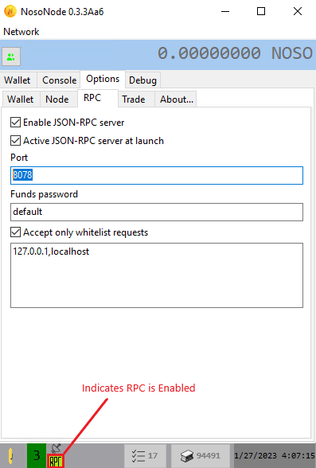

# 💰 Earn Noso on Linux:


<mark style="color:red;">To earn Noso Coins, you will need a wallet and "Noso Earn" software</mark>


\
**Step 1:**\
Download the and install latest version of Nosolite wallet for your OS from Github.com [(here)](https://github.com/Noso-Project/NosoLite/releases)\
Upon installation, Nosolite will generate a default address to use for earning and holding Noso coins.\
\
**Step 2:**\
Download and install the latest "Get Noso"software from Github.com [(here)](https://github.com/Noso-Project/consominer2/releases)

From within a terminal on your Linux machine, enter the following commands:

* <mark style="color:red;">`sudo apt-get update -y && apt-get upgrade -y`</mark>
* <mark style="color:red;">`wget https://github.com/Noso-Project/consominer2/releases/consominer2-v1.6-x86_64-linux.tar.gz`</mark>\ <mark style="color:red;"></mark>
* <mark style="color:red;">`tar -xvzf consominer2-v1.6-x86_64-linux.tar.gz`</mark>\ <mark style="color:red;"></mark>
* <mark style="color:red;">`chmod +x consominer2-v1.6-x86_64-linux`</mark>\ <mark style="color:red;"></mark>
* <mark style="color:red;">`./consominer2-v1.6-x86_64-linux`</mark>


Note, these s assume x86 64bit hardware. If your system has an arm or aarch64 CPU, you will need to use a different binary. Refer to Earn Noso on a Mobile Device for your ARM binary download.


\
**Step 3:**\
After launching "Get Noso" software, press <mark style="color:red;">`ALT+X`</mark> to close. The first "run" will auto-create your configuration files.\
\
Open "consominer2.cfg" using a text editor like Nano. <mark style="color:red;">`nano consominer2.cfg`</mark>\
Select an address from your NosoLite wallet and modify your consominer2.cfg file by modifying the following fields:\


* <mark style="color:red;">`address AddressFromYourNosoLiteWallet`</mark>
* <mark style="color:red;">`cpu 1`</mark>` ``` (setting this to more than 1 CPU is wasteful and doesn't increase your coins earned)
* <mark style="color:red;">`test`</mark> False (set this to "False" so that Earning starts as soon as the app opens)
* Close Nano and save your changes using the key combination `CTRL+X` and when prompted type `Y` to save changes.

With configurations in place, you are now ready to start earning coins.\



Please note, a typical earning period consists of **48 blocks** from the moment you start participating. It takes 7 1/2 hours to go through 48 blocks and you will not see coins in your wallet until after the 7 1/2 hours has lapsed. When participating, you will see a "balance" column with coins pending in green. This is the balance of coins you will receive when your participation period has expired.


<figure><figcaption></figcaption></figure>

## Happy Earning!!!
