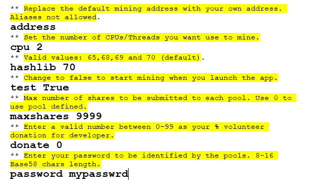

# 💰 Earn Noso using a Mobile Device


<mark style="color:red;">To earn Noso , you  need a wallet and "Noso Earn" software</mark>


\
**Step 1:**\
Download and install the latest version of NosoMobile wallet from Github.com [(here)](https://github.com/Noso-Project/NosoWallet-Android/releases).\
\
\
\
\
\
Upon installation, wallet will generate a default address that you will need to copy/paste in a later step.\
\
**Step 2:**\
Install the Termux App from FDroid app store [(here)](https://f-droid.org/F-Droid.apk) **NOT from Google Playstore!** Once FDroid is installed, open FDroid and Install Termux.\
\
**Step 3:**\
Launch Termux App and perform the following:

`1-Update Termux:`` `**`pkg update`**\


`2-Upgrade Termux:`` `**`pkg upgrade`**\


`3-Install Proot Distro:`` `**`pkg install proot-distro`**\


`4-Install Debian:`` `**`proot-distro install debian`**\


`5-Login to Debian:`` `**`proot-distro login debian`**\


6-Now that you are logged into Proot-Distro Debian, Update, upgrade and install wget and nano:\


```
apt-get update -y && apt-get upgrade -y && apt-get install wget -y && apt-get install nano -y
```

<mark style="color:red;">**7-Download "Get Noso" app for your architecture. If you are unsure, type**</mark><mark style="color:red;">** **</mark><mark style="color:red;">**`uname -m`**</mark><mark style="color:red;">** **</mark><mark style="color:red;">**to determine 32bit or 64bit.**</mark>\
Download "Get Noso" app (version 1.8). Check [(here)](https://github.com/Noso-Project/noso-website/tree/main/docs/download) for other versions.

### For aarch64:<mark style="color:red;">(always check latest releases and dont just copy paste)</mark>

```
wget https://nosocoin.com/docs/download/nosoearn-aarch64
```

### For Arm:<mark style="color:red;">(always check latest releases and dont just copy paste)</mark>

```
wget https://nosocoin.com/docs/download/nosoearn-arm32
```

8-Make "Get Noso" app executable:

### For Aarch64:

```
chmod +x nosoearn-aarch64
```

### For Arm:

```
chmod +x nosoearn-arm32
```

**Step 4:**\
Run "Get Noso" app from within Termux/proot-Distro/Debian:&#x20;

### For Aarch64:

```
./nosoearn-aarch64
```

### For Arm:

```
./nosoearn-arm32
```

\
The inital run creates files needed for further configuration.\
\
**Step5:**\
Close "Get Noso" app with the key combination `alt+X`\
Once closed, you will need to edit the consominer2.cfg configuration file\
Make sure "nosoearner.cfg" exists by typing `ls` You should see files similar to the following:\
\
 \
Use nano to edit the consominer2.cfg:`nano consominer2.cfg`\
Update, copy/paste your wallet address into configuration, set your CPU, and test to "false"

1. copy/paste your wallet address into configuration
2. set your CPU core recomended "2"
3. set test from "True" to "False"
4. Set maxshares from "9999" to "0"
5. set your password from "mypasswd" to something secure ,of 8-16 Base58 chars length&#x20;


\
<mark style="color:yellow;">**SEE IMAGE BELOW**</mark>:\
\


<figure><figcaption></figcaption></figure>

\
\
Close and save your changes using the key combination `CTRL+X` and when prompted type `Y` to save changes.\
\
**With configurations in place, you are now ready to start earning coins.**


Please note, a typical earning period consists of **48 blocks** from the moment you start participating. It takes 7 1/2 hours to go through 48 blocks and you will not see coins in your wallet until after the 7 1/2 hours has lapsed. When participating, you will see a "balance" column with coins pending in green. This is the balance of coins you will receive when your participation period has expired.


\
\
If you have issues with using Termux with Proot Distro on your device, try Userland following instructions [(here).](userland-instructions.md)
