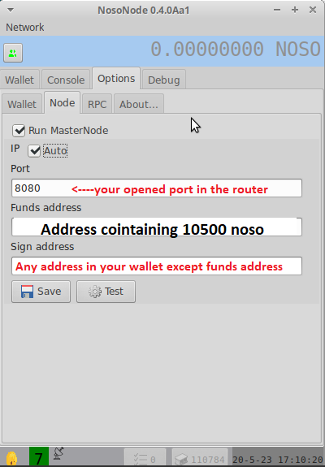

# 🛠 Earn Noso running a Node

To run a masternode, from inside of NosoNode, enter your funds address (address with sufficient Noso) into the “node” tab of "NosoNode"; “test” then “save.” Masternode rewards will begin within 2 blocks and you will see your icon at the bottom left corner of NosoNode change from a wifi antenna to a satellite dish.\
\
<mark style="color:yellow;">**Masternodes (MN)**</mark>\
\

<figure><figcaption></figcaption></figure>


Funds address: address containing the staking amount (<mark style="color:red;">**receives node reward**</mark>)

Sign address: any address in your wallet except the funds address


\
1.Download the latest Noso Node software [(here)](https://github.com/Noso-Project/NosoNode/releases)
----------------------------------------------------------------------------------------------------

## 2.Port forward the prefered port that you want <mark style="color:yellow;">(Default:8080)</mark> in your router

## **Minimum recommended requirements for running a node:**

* System running Windows or Linux OS
* 64bit based hardware.
* 2 CPUs
* 2048 MB Memory
* SSD with at least 1GB of available space
* 100 Mbit/s internet connection
* Publicly accessible IP address (DHCP or Static) with TCP Port forwarding to Noso Node listening port.

## Watch a video on how to setup a node [here](https://www.youtube.com/watch?v=s28rsAH1ffs)


**The MasterNode stake requirement is 10,500 Noso**\
<mark style="color:red;">**(minimum amount to run a node)**</mark>

